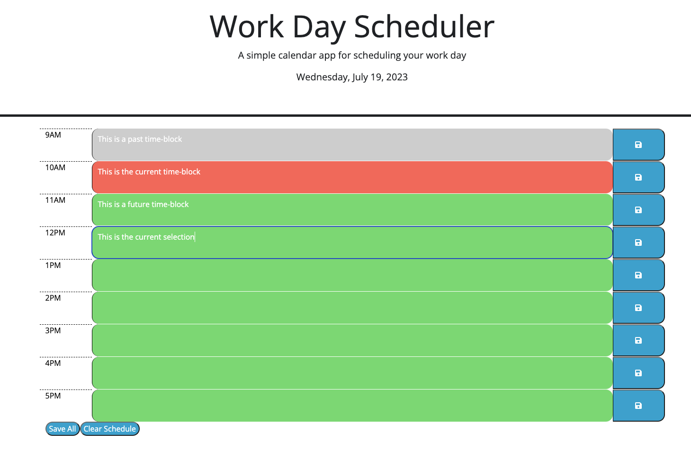

# Calendar App

## Description
This webpage serves as a typical 9-5 workday calendar. It is split by hour in order to record and display a list of TODOs for the current day.

## Installation
N/A

## Usage
In order to use the site simply click in the colored block of time and type what you want to record for that hour. The blocks are colored according to the time. Past hours are grey, the current hour is red, and future hours are green.

You can then save what you have written by clicking the save icon to the right of that time-block or clicking the 'Save All' button at the bottom to save multiple time-blocks at once.

If you want to clear the scheduler you can click the 'Clear Schedule' button at the bottom of the screen. This will clear the local storage for all the time-blocks leaving them blank.

## Credits
This site makes use of both jQuery and Day.js these can be found at the following sites respectively:

https://jquery.com/

https://day.js.org/

## License
Please refer to the LICENSE in the repo.